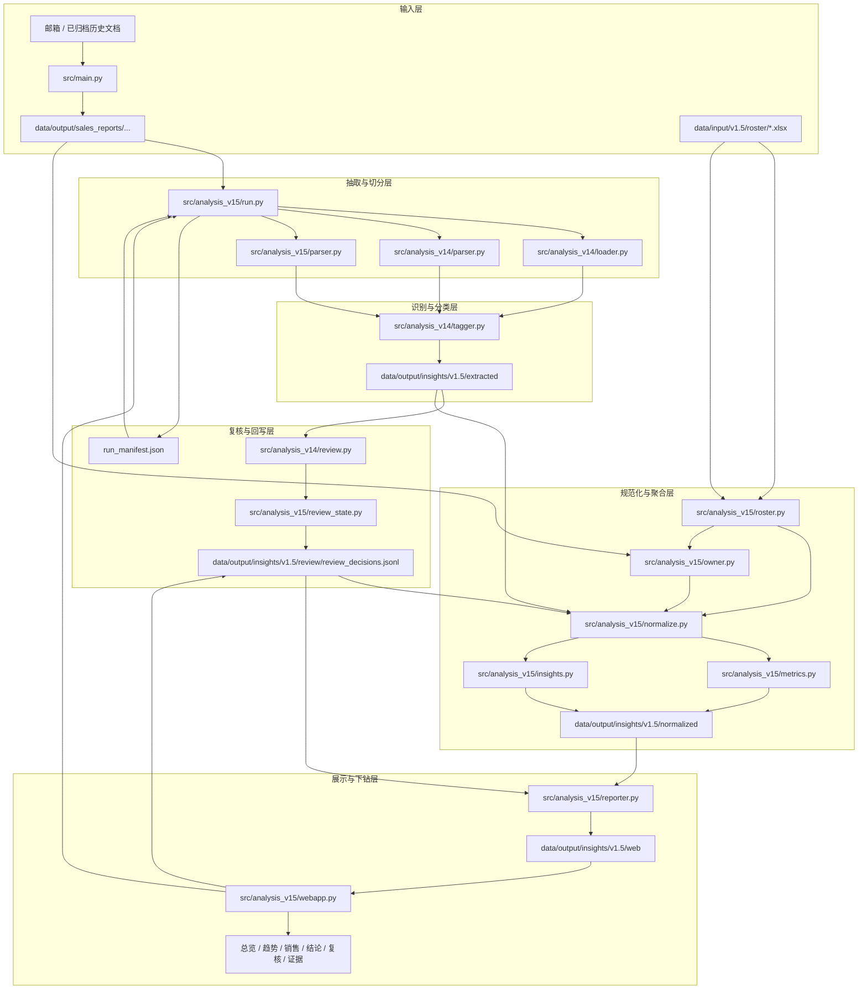

# V1.5 业务实现架构图

## 1. 文档目的与阅读方式
这份材料只回答三件事：

- 当前系统从哪里接数据、如何处理、如何进入页面与复核
- 当前页面上看到的问题，本质上出在哪一层
- 一旦某一层出问题，会向后影响哪些模块

阅读顺序建议：
- 先看 Mermaid 架构图
- 再看六层说明
- 最后看“典型链路示例”和“当前问题定位”

配套图文件见：
- [`system_flow.mmd`](/Users/wales/.codex/worktrees/5fd6/my-test-code_01/docs/releases/v1.5/system_flow.mmd)

## 2. 当前系统一句话概览
当前系统是一个“归档文档驱动的离线 AI 分析链路 + 本地工作台 + 文件回写复核闭环”系统：

- 输入主链路来自 [`src/main.py`](/Users/wales/.codex/worktrees/5fd6/my-test-code_01/src/main.py)
- 分析主链路来自 [`src/analysis_v15/run.py`](/Users/wales/.codex/worktrees/5fd6/my-test-code_01/src/analysis_v15/run.py)
- 页面展示和复核入口来自 [`src/analysis_v15/webapp.py`](/Users/wales/.codex/worktrees/5fd6/my-test-code_01/src/analysis_v15/webapp.py)
- 人工复核结果写回 [`review/review_decisions.jsonl`](/Users/wales/.codex/worktrees/5fd6/my-test-code_01/data/output/insights/v1.5/review/review_decisions.jsonl)
- 下一轮重跑会再次消费人工复核结果

## 3. 完整业务实现架构图

## 4. 数据输入层
### 4.1 输入是什么
- 邮箱中的周报 / 月报邮件及其附件，经 [`src/main.py`](/Users/wales/.codex/worktrees/5fd6/my-test-code_01/src/main.py) 下载归档
- 已经归档在 [`data/output/sales_reports/...`](/Users/wales/.codex/worktrees/5fd6/my-test-code_01/data/output/sales_reports) 的历史文档
- 花名册 [`data/input/v1.5/roster/*.xlsx`](/Users/wales/.codex/worktrees/5fd6/my-test-code_01/data/input/v1.5/roster)

### 4.2 输入格式
- 周报 / 月报归档支持：`docx`、`doc`、`pdf`、`txt`、`md`
- 花名册支持：`xlsx`

### 4.3 新一轮周报怎么接入
- 邮箱拉取与归档仍由 [`src/main.py`](/Users/wales/.codex/worktrees/5fd6/my-test-code_01/src/main.py) 处理
- 归档结果落在 [`data/output/sales_reports/...`](/Users/wales/.codex/worktrees/5fd6/my-test-code_01/data/output/sales_reports)
- `v1.5` 分析链路不直接连邮箱，而是从归档目录重扫输入

### 4.4 历史归档如何参与分析
- [`src/analysis_v14/loader.py`](/Users/wales/.codex/worktrees/5fd6/my-test-code_01/src/analysis_v14/loader.py) 递归扫描归档目录
- 通过文件路径中的 `年 / 月 / 第N周 / 月报` 信息推断时间与报告类型
- 因此历史归档和新增周报是同一分析入口

### 4.5 本层责任边界
- 负责“把文档稳定放进可分析目录”
- 不负责正文理解、标签判断、趋势聚合和页面展示

### 4.6 本层已知问题
- 当前分析链路仍依赖归档目录命名质量
- 如果归档目录本身分周错位，会把错误时间直接带入后续趋势与周度分析

## 5. 数据处理层
### 5.1 这一层做什么
- 识别有哪些文件要分析
- 提取正文
- 做段落 / 句段切分
- 识别销售、区域、战区、时间等元信息

### 5.2 关键模块
- 文件扫描与报告识别：[`src/analysis_v14/loader.py`](/Users/wales/.codex/worktrees/5fd6/my-test-code_01/src/analysis_v14/loader.py)
- 正文抽取：[`src/analysis_v14/parser.py`](/Users/wales/.codex/worktrees/5fd6/my-test-code_01/src/analysis_v14/parser.py)
- 带负责人切分：[`src/analysis_v15/parser.py`](/Users/wales/.codex/worktrees/5fd6/my-test-code_01/src/analysis_v15/parser.py)
- 花名册读取：[`src/analysis_v15/roster.py`](/Users/wales/.codex/worktrees/5fd6/my-test-code_01/src/analysis_v15/roster.py)
- owner 归一：[`src/analysis_v15/owner.py`](/Users/wales/.codex/worktrees/5fd6/my-test-code_01/src/analysis_v15/owner.py)

### 5.3 输入与输出
- 输入：归档文档、花名册
- 中间输出：
  - `report_rows`
  - 切分后的 `segment_items`
  - `owner_registry`
  - `sales_roster`

### 5.4 责任边界
- 负责“能否把原文与人、时间、区域挂上”
- 不负责 AI 标签判断和业务趋势解释

### 5.5 上游出错会影响什么
- 正文抽取错：后面所有标签、结论、复核都会错
- 销售归一错：销售画像、区域构成、趋势解释会失真
- 时间识别错：月度/周度趋势都会错位

### 5.6 当前已知问题
- `owner_hint` 仍有残留噪声，销售个人识别还不是组织主数据级精度
- `.doc/.pdf` 提取仍依赖工具链，失败时只能降级为复核任务
- 切分规则仍偏“句段”，不一定等于业务完整语义单元

## 6. 分析层
### 6.1 这一层做什么
- 判断一段文本是否命中 AI
- 识别业务线、主体、AI 范围、状态
- 生成 `review_queue`
- 把标签和证据规范化成趋势、画像、结论、工作台快照

### 6.2 关键模块
- 分类器：[`src/analysis_v14/tagger.py`](/Users/wales/.codex/worktrees/5fd6/my-test-code_01/src/analysis_v14/tagger.py)
- review queue 生成：[`src/analysis_v14/review.py`](/Users/wales/.codex/worktrees/5fd6/my-test-code_01/src/analysis_v14/review.py)
- 规范化：[`src/analysis_v15/normalize.py`](/Users/wales/.codex/worktrees/5fd6/my-test-code_01/src/analysis_v15/normalize.py)
- 趋势聚合：[`src/analysis_v15/metrics.py`](/Users/wales/.codex/worktrees/5fd6/my-test-code_01/src/analysis_v15/metrics.py)
- 结论树：[`src/analysis_v15/insights.py`](/Users/wales/.codex/worktrees/5fd6/my-test-code_01/src/analysis_v15/insights.py)

### 6.3 中间结果与最终结果
中间结果：
- `extracted/report_index.jsonl`
- `extracted/tag_result.jsonl`
- `extracted/evidence_span.jsonl`
- `extracted/review_queue.jsonl`

最终供工作台消费的结果：
- `normalized/report_facts.jsonl`
- `normalized/evidence_facts.jsonl`
- `normalized/trend_cube.json`
- `normalized/trend_explanations.json`
- `normalized/salesperson_profile.jsonl`
- `normalized/insight_tree.json`
- `normalized/review_tasks.jsonl`
- `normalized/dashboard_snapshot.json`

### 6.4 责任边界
- 负责“把原始证据转换成业务结构对象”
- 不负责页面交互本身，也不负责邮箱下载归档

### 6.5 当前已知问题
- 分类器仍以规则为主，复杂语义会进入 `pending_human_review`
- 趋势解释文本主要来自规则聚合，不是大模型总结
- 结论卡也是证据簇 + 模板逻辑，不是运行时模型洞察
- 因此“食之无味”主要是分析方法层和结论抽取层不够强，不是展示层单独的问题

## 7. 复核层
### 7.1 这一层做什么
- 把不稳定结果变成待复核任务
- 接收人工修改
- 写回正式复核结果
- 下一轮重跑时覆盖原判断

### 7.2 关键模块
- 初始 `review_queue` 生成：[`src/analysis_v14/review.py`](/Users/wales/.codex/worktrees/5fd6/my-test-code_01/src/analysis_v14/review.py)
- 复核任务对象与写回：[`src/analysis_v15/review_state.py`](/Users/wales/.codex/worktrees/5fd6/my-test-code_01/src/analysis_v15/review_state.py)
- 复核交互入口：[`src/analysis_v15/webapp.py`](/Users/wales/.codex/worktrees/5fd6/my-test-code_01/src/analysis_v15/webapp.py)

### 7.3 输入与输出
- 输入：`review_queue`、`tag_result`、`report_facts`
- 输出：
  - `normalized/review_tasks.jsonl`
  - `review/review_decisions.jsonl`
  - `review/review_audit_log.jsonl`

### 7.4 写回后更新什么
- 下一轮 `normalize.py` 会优先读 `review_decisions`
- `evidence_facts` 中的 `business_line / actor_primary / ai_scope / decision_status / review_status` 会被覆盖
- 随后影响趋势、销售画像、结论卡和页面快照

### 7.5 当前已知问题
- 现在是文件回写 MVP，不是正式数据库工作流
- 单人可用，多人协作会出现并发和状态管理问题
- 复核闭环已经存在，但“训练素材回流”目前仍是规则与人工复盘，不是自动学习闭环

## 8. 展示层
### 8.1 这一层做什么
- 把规范化对象渲染为工作台页面
- 支持下钻、筛选、逐条复核与重建

### 8.2 关键模块
- 静态页面生成：[`src/analysis_v15/reporter.py`](/Users/wales/.codex/worktrees/5fd6/my-test-code_01/src/analysis_v15/reporter.py)
- 本地交互服务：[`src/analysis_v15/webapp.py`](/Users/wales/.codex/worktrees/5fd6/my-test-code_01/src/analysis_v15/webapp.py)
- 页面产物：[`data/output/insights/v1.5/web`](/Users/wales/.codex/worktrees/5fd6/my-test-code_01/data/output/insights/v1.5/web)

### 8.3 页面依赖哪些数据
- 总览页：`dashboard_snapshot`
- 趋势页：`trend_cube`、`trend_explanations`、`evidence_index`
- 销售页：`salesperson_profile`、`region_sales_rollup`
- 结论页：`insight_tree`
- 复核页：`review_tasks` + `review_decisions`
- 证据页：`evidence_index`

### 8.4 哪些页面是总览层，哪些是支撑层
- 总览层：`overview`
- 支撑层：`trends / sales / insights / review / evidence`

### 8.5 当前已知问题
- 展示层的问题主要是“把上游问题暴露出来”，不是唯一根因
- 如果上游证据簇质量、标签稳定性、复核积压没有解决，页面再改也只是换一种展示方式

## 9. 典型链路示例：一份周报从进入到展示再到复核回流
1. 周报邮件被 [`src/main.py`](/Users/wales/.codex/worktrees/5fd6/my-test-code_01/src/main.py) 下载，归档到 [`data/output/sales_reports/...`](/Users/wales/.codex/worktrees/5fd6/my-test-code_01/data/output/sales_reports)
2. [`src/analysis_v15/run.py`](/Users/wales/.codex/worktrees/5fd6/my-test-code_01/src/analysis_v15/run.py) 扫描文件
3. [`src/analysis_v14/parser.py`](/Users/wales/.codex/worktrees/5fd6/my-test-code_01/src/analysis_v14/parser.py) 提取正文
4. [`src/analysis_v15/parser.py`](/Users/wales/.codex/worktrees/5fd6/my-test-code_01/src/analysis_v15/parser.py) 切分片段并尝试识别段落负责人
5. [`src/analysis_v14/tagger.py`](/Users/wales/.codex/worktrees/5fd6/my-test-code_01/src/analysis_v14/tagger.py) 对每个片段做 AI / 业务线 / 主体 / 范围判断
6. 不稳定结果进入 `review_queue`
7. [`src/analysis_v15/roster.py`](/Users/wales/.codex/worktrees/5fd6/my-test-code_01/src/analysis_v15/roster.py) 和 [`src/analysis_v15/owner.py`](/Users/wales/.codex/worktrees/5fd6/my-test-code_01/src/analysis_v15/owner.py) 负责把花名册和 owner 提示接上
8. [`src/analysis_v15/normalize.py`](/Users/wales/.codex/worktrees/5fd6/my-test-code_01/src/analysis_v15/normalize.py) 生成 `report_facts / evidence_facts / review_tasks`
9. [`src/analysis_v15/metrics.py`](/Users/wales/.codex/worktrees/5fd6/my-test-code_01/src/analysis_v15/metrics.py) 生成趋势和快照
10. [`src/analysis_v15/insights.py`](/Users/wales/.codex/worktrees/5fd6/my-test-code_01/src/analysis_v15/insights.py) 生成洞察树
11. [`src/analysis_v15/reporter.py`](/Users/wales/.codex/worktrees/5fd6/my-test-code_01/src/analysis_v15/reporter.py) 输出页面
12. [`src/analysis_v15/webapp.py`](/Users/wales/.codex/worktrees/5fd6/my-test-code_01/src/analysis_v15/webapp.py) 提供复核提交与重建
13. 人工复核写入 [`review/review_decisions.jsonl`](/Users/wales/.codex/worktrees/5fd6/my-test-code_01/data/output/insights/v1.5/review/review_decisions.jsonl)
14. 下一轮重跑时再次消费人工结果，更新趋势、销售画像、结论和页面

## 10. 当前问题定位：页面问题分别对应哪一层
- “时间维度不清楚”：首先是 `BI 数据层 / 规范化与聚合层` 的问题
- “趋势解释太浅”：首先是 `分析方法层` 的问题
- “结论食之无味”：首先是 `结论抽取层` 的问题
- “复核还不够像系统”：首先是 `复核闭环层` 的问题
- “页面看着不顺”：这是展示层问题，但通常不是主因

## 11. 本文结论
当前系统最主要的问题集中在四层：
- `BI 数据层`
- `分析方法层`
- `结论抽取层`
- `复核闭环层`

展示层的问题真实存在，但更像上游问题被放大后的表现，不是当前最应该先修的根因。
